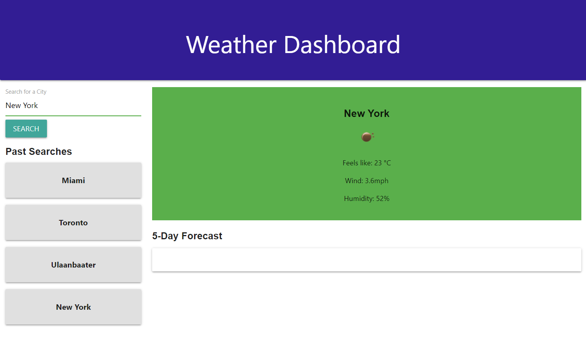

# Weather-Dashboard

## Description
The Weather Dashboard is a website where users can search up real-time weather of cities around the world! 

## Installation
The website can be accessed on any browser by inputting the below URL for the deployed site into the address bar. Once on the page, they will input the city they would like to search in the search bar. 
https://temuts.github.io/Weather-Dashboard/

## Usage
Once the website can be accessed through the deployed site URL, the user will see that the page is empty. They will navigate to the search bar on the top left of the page to search the city for which they would like to retrieve weather information. This information is then presented in the green bar: the city name, an icon to represent the weather state, the "Feels like" temperature in Celsius, the Windiness in miles per hour, and the Humidity in percentage form. The searched city will be added to a bar of "Past Searches" on the left hand side where all city searches are accummulated. The developer is currently working on deploying the five-day forecast below this information, which will be updated soon. 

The deployed page currently looks like this: 

## Credits
This project has been built using the following: 
Open Weather API - https://openweathermap.org/
JQuery - https://code.jquery.com/jquery-3.4.1.min.js
Materialize - https://materializecss.com/

## License
N/A
